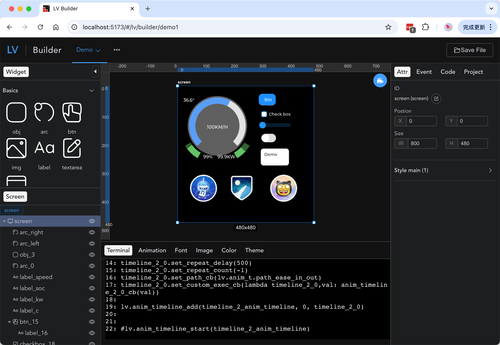

# LV Builder
[WIP] Drag end drop GUI designer for LVGL

## Demo

<table>
<tr>
    <td><a href="https://qdsang.github.io/lv_gui_builder/#/lv/builder/demo1"></a></td>
    <td><a href="https://qdsang.github.io/lv_gui_builder/#/lv/builder/widget"></a></td>
</tr>
</table>

## Try It Online

  https://qdsang.github.io/lv_gui_builder/


## 🚀 Development

```bash
# configure
1. installation of the recommended plugins in the .vscode directory
2. node version 18.x or 20+
3. npm version 8.x or latest

# clone
git clone xxx

# enter the project directory
cd lv_gui_builder

# install dependencies
npm i

# start the service
npm run serve
```

## ✔️ Preview

```bash
# stage environment
npm run preview


open http://localhost:5173/#/lv/builder/demo1
```


## TODO
v1  
- [x] Emulator
- [x] Code refactoring
- [x] Property management
- [x] Component list
- [x] Component addition
- [x] Component duplication
- [x] Modify ID
- [x] Component property styles
- [ ] Align
- [X] Component sorting (zindex)
- [X] Component size drag
- [ ] Style grouping
- [ ] Generate C
- [X] Shortcuts
- [X] Window Layout [golden-layout](https://golden-layout.com/) [vue-grid-layout](https://jbaysolutions.github.io/vue-grid-layout/guide/04-allow-ignore.html)

v2  
- [X] Project settings
- [ ] Events
- [ ] Font library https://lvgl.io/tools/font_conv_v5_3
- [X] Image library https://lvgl.io/tools/imageconverter_v9
- [ ] Color library
- [x] Animation library
- [ ] i18n

v3  
- [ ] VSCode Extension https://github.com/microsoft/vscode-extension-samples/tree/main/custom-editor-sample
- [ ] Low Code
- [ ] LVGL Version Manager


## Reference
- https://github.com/kaiakz/lv_gui_designer
- https://github.com/kaiakz/walv/tree/master
- https://forum.littlevgl.com/t/wysiwyg-editor-for-littlevgl/642
- https://github.com/rohmer/LVGL_UI_Creator
- https://github.com/CURTLab/LVGLBuilder
- https://github.com/lvgl/lv_gui_builder
- https://sim.lvgl.io/v8.3/micropython/ports/javascript/index.html
- https://github.com/nishad2m8/T-Display-S3-YT/tree/master
- https://github.com/peterhinch/micropython-font-to-py/blob/master/font_to_py.py
- https://github.com/nishad2m8/T-Display-S3-YT


## Contribution

Please make sure to read the [Contributing Guide](https://github.com/vuejs/core/blob/main/.github/contributing.md) before making a pull request.

Thank you to all the people who already contributed to Builder!

<a href="https://github.com/qdsang/lv_gui_builder/graphs/contributors"></a>

## Star History

[](https://star-history.com/#qdsang/lv_gui_builder&Date)


## License

[MIT](https://opensource.org/licenses/MIT)
